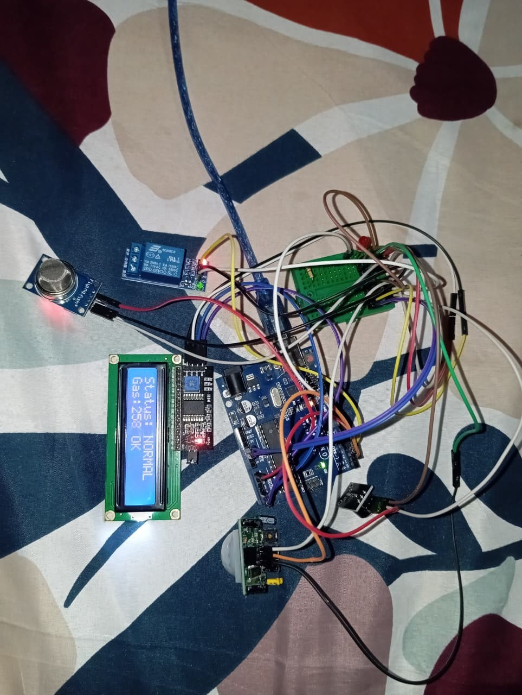
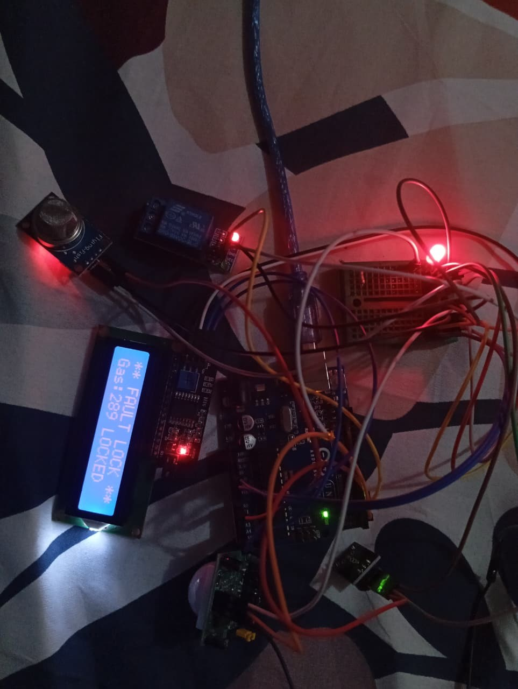

# Edge-Computing Smart Home Appliance (Interrupts & Safety)

## Overview
Arduino Uno-based edge device demonstrating hardware interrupts and 
industrial safety fail-safes. A PIR motion sensor controls a relay using 
a hardware interrupt (ISR), while an MQ-2 gas/smoke sensor continuously 
monitors for danger and can override the system into a locked fault state, 
alerting via buzzer and LED.

## Components
- Arduino Uno
- PIR Motion Sensor (HC-SR501)
- MQ-2 Gas/Smoke Sensor
- 5V Relay Module (opto-isolated, JD-VCC jumper removed)
- Active Buzzer
- Red LED
- I2C LCD 16x2

## Key Features
- Hardware interrupt (attachInterrupt) on PIR for instant motion response
- Software debounce (50ms) on the interrupt
- Analog gas threshold monitoring with a validation window to avoid false-positive lockdowns
- Permanent fault-lock state on confirmed gas detection — overrides all normal operation
- Live system status shown on I2C LCD

## Wiring
| Component | Uno Pin |
|---|---|
| PIR OUT | D2 (interrupt) |
| Buzzer | D3 |
| Relay IN | D4 |
| Red LED | D5 |
| MQ-2 AO | A0 |
| LCD SDA/SCL | A4/A5 |

Full pin-by-pin wiring details in [docs/WIRING.md](docs/WIRING.md).

## Safety Design Notes
- Relay's JD-VCC jumper removed for opto-isolation between logic and switched sides
- Fault state is permanent until manual board reset — matches industrial 
  fail-safe practice (no silent auto-recovery from a gas fault)

## Demo

### Normal Operation
PIR/relay control active, MQ-2 reading displayed live, no fault detected.

### Fault Lockdown
Gas threshold exceeded and validated — system locked, buzzer active, red LED flashing, motor/relay forced off.

### Full Demo Video
Shows normal sensor readings, followed by smoke/gas introduced near the MQ-2 sensor, triggering the validation window and subsequent lockdown with buzzer alert.

[Watch demo video](images/demo-video.mp4)
